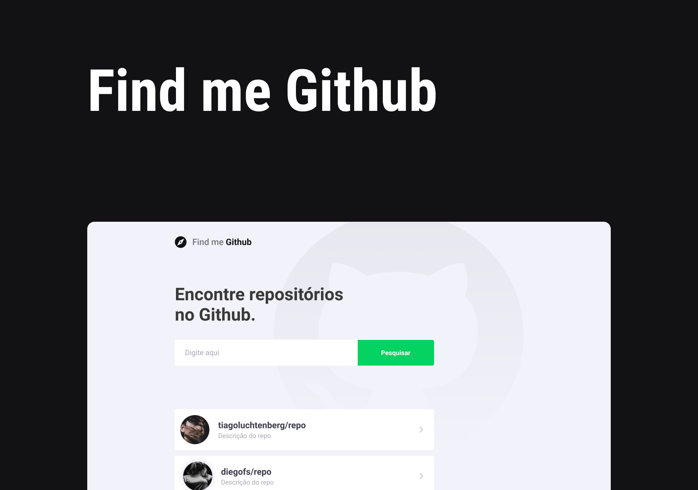

<h1 align="center">
    
</h1>


<h1 align="center">
    
</h1>

<h3 align="center">Você pode acessar o projeto <a href="https://findmegithub.netlify.app/" target="_blank">clicando aqui</a></h3>

---
<br />

# Sobre o projeto
**Find me Github** é um projeto pessoal com o objetivo de encontrar repositórios no [Github](https://github.com/) consumindo a própria API do Github, basta digitar o nome do usuário/nome do repositório, clicando em pesquisar, irá mostrar o resultado, clicando novamente em cima do resultado será redirecionado para mostrar os detalhes como: Stars, Forks e Issues abertas. Além disso, as pesquisas feitas ficam salvas no localStorage do navegador e está totalmente responsivo para ser acessado de qualquer dispositivo.

<br/>
---

# Tecnologias
- [React](https://pt-br.reactjs.org/)
- [TypeScript](https://www.typescriptlang.org/)
- [Styled-Components](https://styled-components.com/)

---
<br/>

## Como baixar o projeto:

```bash
# Clonar o repositório
$ git clone https://github.com/wellingtonrodriguesbr/findme-github.git

# Entrar no diretório
$ cd findme-github

# Instalar as dependências
$ yarn install

# Rodar o projeto
$ yarn start
```
---

<p align="center"> Desenvolvido por <a href="https://www.linkedin.com/in/wellingtonrodriguesbr/">Wellington Rodrigues</a> ✌🏼</p>
